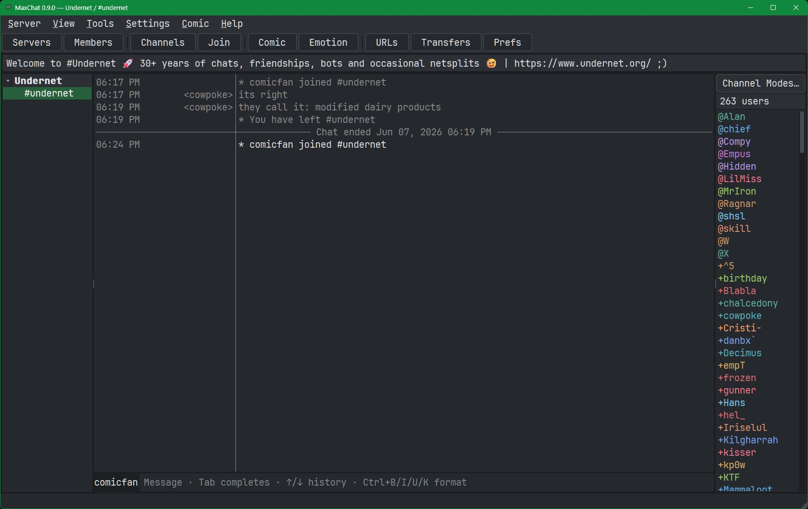
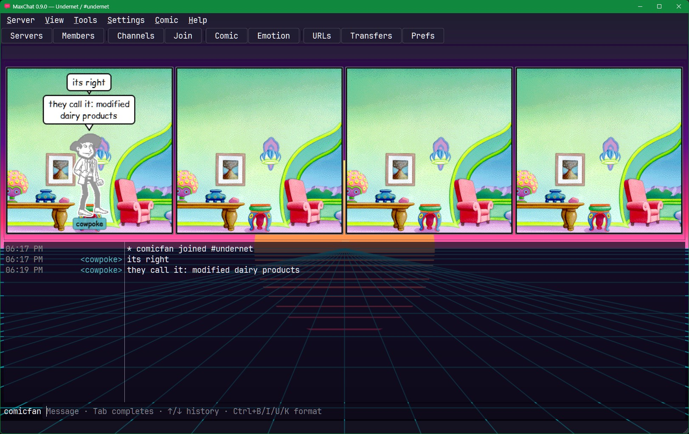

# MaxChat

> A comic-strip-style graphical IRC client.

MaxChat is a real desktop **IRC client** with an optional **comic mode**: flip it on and the
conversation is drawn as a comic strip — each message becomes a panel with an expressive character,
a chosen emotion, a speech (or thought) balloon, and a scene backdrop. Flip it off and it's a clean,
modern IRC client.

> **Unofficial** and not affiliated with, authorized by, or endorsed by any other chat program or its
> rights holders. It ships **no third-party character art** — you point the app at your own classic
> external comic art install (see Quick start). Built with Python 3 + PySide6 (Qt 6); targets **Windows and Linux**.

## Screenshots

| No-theme chat view | Comic mode with theme turned on |
| --- | --- |
|  |  |

---

## Features

**IRC client**
- Bundled server directory with many popular IRC networks, failover servers, network homepages,
  type-to-jump search, and a **Reset server list** option
- TLS with certificate validation by default; `Accept unsigned` is an explicit per-network exception
- **CAP + SASL** (PLAIN, with NickServ fallback); passwords are sent only over TLS unless a saved
  network explicitly enables plaintext auth
- Auto-connect/join, **auto-reconnect**
- **Multiple networks at once** — a clickable network tree with channels, queries, and a server tab each
- Channels + private queries · notices · `/me` actions · **CTCP** auto-reply + request/reply in chat
- **WHOIS to the active chat** · **PMs echoed** to the server tab & current chat (so you never miss one)
- Full **HexChat/mIRC-style command set** (current-channel defaults): `/topic /kick /op /ban /mode /msg …`
- **Channel Modes** popup (t/n/s/i/p/m + key/limit) · **right-click** op/kick/ban/CTCP/ignore menus
- **/list** channel browser (sortable, min-users, join-on-click, CSV/copy)
- **Ignore list** (`/ignore`, glob over `nick!user@host`) · tab-completion · input history · format keys
- **Logging** + **replay** on open (with an "Ended" divider) · per-chat scrollback
- **Anti-flood protection** (auto-ignore flooders, large-paste guard, invite-spam guard) · **system-tray** + taskbar-flash notifications · **friends / notify list**
- **Link previews** — inline images/audio/video, X/Twitter cards, and generic OpenGraph website cards
  with thumbnails, controlled from **Preferences ▸ Services**
- **DCC file transfer** (right-click ▸ Send File; transfers window) with **passive / reverse DCC** for NAT/firewalls
- **Raw log, URL list, and server tools** are built in for the practical day-to-day IRC chores
- **Python scripting** — drop `.py` scripts in your scripts folder (message/join/command hooks); bundled URL-logger + a hello demo (see `scripts-examples/`)

**Comic mode**
- Decodes classic comic `.avb`/`.bgb` art **from your own install** (you point the app at it)
- Panels with **multiple characters** (facing each other), **varied body poses**, **emotions**, and
  speech/thought balloons in a bundled **comic font** (Comic Relief, OFL)
- **Emotion picker + self-view** — choose your own expression (or let it guess from your text)
- **Per-channel** backgrounds + **per-user character** assignments
- 1–6 **reflowing panels**, remembered per channel · **Save Comic…** exports the strip as a PNG
- Comic rendering stays local: no special server support is required, and normal IRC users still just see normal text

**Appearance**
- App + chat themes (incl. faithful **irssi**/**BitchX** chat looks) + a theme customizer + user JSON themes
- **Default** theme plus a **Turn themes off** option for users who want Qt/platform colors instead of MaxChat styling
- Per-pane fonts, one-click **JetBrains Mono** / **System Default** font presets, 12/24-hour clock,
  colored nicks / IRCCloud-style role groups, framed menus & popups
- A bigger, left-nav **Preferences** dialog with wrapped help text, **Services** toggles,
  spellcheck/language settings, and translation catalog support
- Clean first-run defaults: Synthwave theme, JetBrains Mono bold UI/chat font, populated server list,
  spellcheck on, and link-preview services ready to use

---

## Quick start

### Linux

```bash
cd maxchat                               # wherever you put it
python -m venv .venv && . .venv/bin/activate
pip install -r requirements.txt
python -m maxchat                      # launch
```

### Windows

```bat
cd C:\apps\maxchat
python -m venv .venv
.venv\Scripts\activate
pip install -r requirements.txt
python -m maxchat
```

Then **Server ▸ Server List…** to choose a saved network, or **Server ▸ Quick Connect…** for a
one-off connection. Comic mode is optional — see **Comic art** below to switch it on.

If you already have a local checkout with a virtualenv, `./run.sh` launches MaxChat on Linux/WSL and
uses `.venv/bin/python` directly when it exists.

## Server list

Open **Server ▸ Server List…** to choose or edit networks. A network can have multiple server lines;
the first one is treated as the primary server and the remaining lines are used as backups/failover.
The list also stores each network homepage, shown in the server list popup with a homepage button.

Useful server-list controls:
- Press a letter while the server list is focused to jump through network names.
- Use the up/down buttons beside **Server(s)** to reorder a network's servers.
- Use **Preferences ▸ Data ▸ Reset server list** to restore the bundled defaults.
- More IRC network information can be found at <https://www.irchelp.org> and <https://netsplit.de/>.

## Link previews and cards

MaxChat can preview links directly in chat. Image links show thumbnails, audio/video links get inline
play controls, X/Twitter status links get a compact status card, and normal website links use public
OpenGraph/Twitter-card metadata to show a small summary card. If a page advertises an image, MaxChat
shows that thumbnail under the card; clicking it opens the original shared page.

Preview fetching is optional per service under **Preferences ▸ Services**:
- **Image previews** controls direct image thumbnails and card thumbnails.
- **X / Twitter cards** controls x.com/twitter.com status cards.
- **Website cards** controls generic OpenGraph cards for public web links, including Mastodon,
  Bluesky, YouTube, news articles, and other sites that publish usable metadata.

Privacy note: fetching a preview contacts the linked host from your computer. Turning a service off
keeps the plain clickable link in chat and skips that automatic fetch.

## Comic art (optional)

MaxChat ships **no character art**. Comic mode reads `.avb` (characters) and `.bgb` (backgrounds)
art from a **classic late-1990s chat-art program** that you install separately and point MaxChat at:

1. Download the classic program — English, ~1.7 MB:
   <https://phoenix-online-nexus.com/mschat/cchat/mschat25.exe>
   (other languages: <https://phoenix-online-nexus.com/mschat/mschat.htm>)
2. Install it (or just extract the `.avb`/`.bgb` files from its folder somewhere).
3. In MaxChat, open **Comic ▸ Comic Settings**, set the **art folder** to that install
   directory, then click **Comic** on the toolbar.

Without art, MaxChat runs as a normal IRC client — comic mode simply has nothing to draw.

## Localization and spelling

MaxChat currently ships with English UI text, plus translation-loading support and Qt `.ts` source
catalogs for German, Spanish, French, Dutch, and Portuguese (Brazil) under `translations/`.
The saved interface language lives in **Preferences ▸ Localization**; completed compiled catalogs can
be dropped into `assets/translations/`.

Spellcheck is enabled by default in the message input for bundled pure-Python dictionaries. Misspelled
words mark the input box and right-clicking the word offers replacement suggestions. Languages without
a bundled dictionary are shown as disabled placeholders until dictionaries are added.

## Develop

```bash
pip install -r requirements-dev.txt      # test/lint/build tools
pytest                                   # headless test suite
ruff check maxchat tests               # lint
pyinstaller maxchat.spec               # build a standalone binary
```

Translation catalogs can be refreshed with:

```bash
python DEVDOCS/tools/update_translations.py
```

The script writes source catalogs to `translations/` and compiled `.qm` files to
`assets/translations/` once real translations are filled in.

## Project layout

```
maxchat/
├── app.py            # QApplication bootstrap (theme, tray, popup shadows)
├── config.py         # per-OS config/cache (QStandardPaths)
├── irc/              # IRC protocol: connection, message parsing, state (UI-free)
├── ui/               # Qt widgets: main window + dialogs (server list, prefs, comic settings, …)
└── comic/            # the comic renderer: art decode, characters/emotions/poses, panels
assets/fonts/         # bundled OFL comic font (Comic Relief)
assets/translations/  # compiled Qt .qm translations, when available
scripts-examples/     # optional Python scripting examples
translations/         # Qt .ts translation source catalogs
```

## License

Licensed under the **Apache License 2.0** — see [LICENSE](LICENSE). The bundled font (Comic Relief)
is under the SIL Open Font License 1.1 (`assets/fonts/OFL.txt`), which is unaffected by the project
license.
