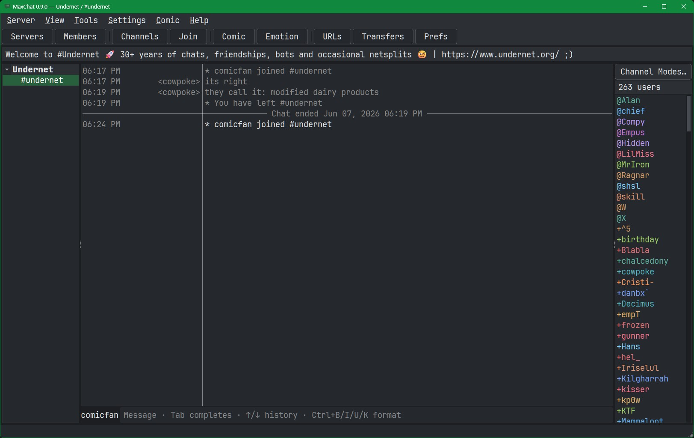
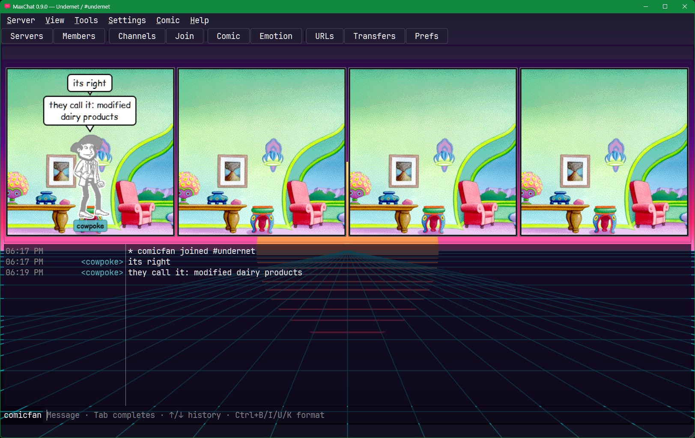

# MaxChat

> A comic-strip-style graphical IRC client.

MaxChat is the native C++/Qt rewrite of the original Python/Qt MaxChat prototype: a real
desktop **IRC client** with an optional **comic mode**. Flip comic mode on and the conversation
is drawn as a comic strip — each message becomes a panel with an expressive character,
a chosen emotion, a speech (or thought) balloon, and a scene backdrop. Flip it off and it's a clean,
modern IRC client.

> **Unofficial** and not affiliated with, authorized by, or endorsed by any other chat program or its
> rights holders. It ships **no third-party character art** — you point the app at your own classic
> external comic art install (see [Comic art](#comic-art-optional)). Built with **C++ and Qt 6**;
> targets **Windows, Linux and macOS (Apple Silicon)**.

## Screenshots

| No-theme chat view | Comic mode with theme turned on |
| --- | --- |
|  |  |

---

## Features

**IRC client**
- Bundled server directory with many popular IRC networks, failover servers, network homepages,
  type-to-jump search, and a **Reset server list** option
- TLS with certificate validation by default; `Accept unsigned` is an explicit per-network exception
- **CAP + SASL** (PLAIN, with NickServ fallback); passwords are sent only over TLS unless a saved
  network explicitly enables plaintext auth
- Auto-connect/join, **auto-reconnect**
- **Multiple networks at once** — a clickable network tree with channels, queries, and a server tab each
- Channels + private queries · notices · `/me` actions · **CTCP** auto-reply + request/reply in chat
- **WHOIS to the active chat** · **PMs echoed** to the server tab & current chat (so you never miss one)
- Full classic **IRC command set** (current-channel defaults): `/topic /kick /op /ban /mode /msg …`
- **Channel Modes** popup (t/n/s/i/p/m + key/limit) · **right-click** op/kick/ban/CTCP/ignore menus
- **/list** channel browser (sortable, min-users, join-on-click, CSV/copy)
- **Ignore list** (`/ignore`, glob over `nick!user@host`) · tab-completion · input history · format keys
- **Logging** + **replay** on open (with an "Ended" divider) · per-chat scrollback
- **Anti-flood protection** (auto-ignore flooders, large-paste guard, invite-spam guard) · **system-tray** + taskbar-flash notifications · **friends / notify list**
- **Link previews** — inline images/audio/video, X/Twitter cards, and generic OpenGraph website cards
  with thumbnails, controlled from **Preferences ▸ CTCP/Services** (SSRF-safe fetcher: per-redirect-hop
  re-validation, private-address blocking, response-size caps)
- **DCC file transfer** (right-click ▸ Send File; transfers window) with **passive / reverse DCC** for NAT/firewalls
- **Lua scripting** — drop `.lua` scripts in your scripts folder (message/join/command hooks) behind a
  per-script permission prompt; bundled examples include a URL logger, dice, weather, seen, reminders,
  a memo, and a small BBS (see `assets/scripts/`)
- **Raw log, URL list, and server tools** are built in for the practical day-to-day IRC chores

**Comic mode**
- Decodes classic comic `.avb`/`.bgb` art **from your own install** (you point the app at it)
- Panels with **multiple characters** (facing each other), **varied body poses**, **emotions**, and
  speech/thought balloons in a bundled **comic font** (Comic Relief, OFL)
- **Emotion picker + self-view** — choose your own expression (or let it guess from your text)
- **Per-channel** backgrounds + **per-user character** assignments
- 1–6 **reflowing panels**, remembered per channel · **Save Comic…** exports the strip as a PNG
- Comic rendering stays local: no special server support is required, and normal IRC users still just see normal text

**Appearance**
- App + chat themes (including faithful retro / classic-terminal chat looks) + a live theme customizer
  and user JSON themes
- A bundled **theme-pack gallery** (59 ready-made looks with previews + wallpapers) you import from
  **Preferences ▸ Themes ▸ Import**, plus a standalone **Theme Builder** (Help ▸ Theme Builder) for
  making your own
- **Default** theme plus a **Turn themes off** option for users who want native Qt/platform colors
- Per-pane fonts, one-click **JetBrains Mono** / **System Default** font presets, 12/24-hour clock,
  colored nicks / IRCCloud-style role groups, framed menus & popups
- A left-nav **Preferences** dialog with wrapped help text, link-preview toggles,
  spellcheck/language settings, and translation support

**Languages & spelling**
- **16 translated UI languages** (German, Spanish, French, Italian, Portuguese, Dutch, Polish, Turkish,
  Russian, Ukrainian, Japanese, Korean, Chinese Simplified/Traditional, Arabic, Hindi) plus English; set
  under **Preferences ▸ Localization**
- Offline spellcheck via a bundled engine with dictionaries for many languages; on Windows an optional
  native speller backend is available. Misspelled words mark the input; right-click for suggestions

---

## Install

### Download (recommended)

Grab the latest build from the [Releases](https://github.com/IronWolve/MaxChat/releases) page:

- **Windows** — download `MaxChat-<version>-windows-x64.zip`, unzip it, and run `maxchat.exe`.
  Everything it needs (Qt, themes, wallpapers, dictionaries, fonts) is in the zip.
- **Linux** — download `MaxChat-<version>-x86_64.AppImage`, then:
  ```bash
  chmod +x MaxChat-*-x86_64.AppImage
  ./MaxChat-*-x86_64.AppImage
  ```
  It's a single self-contained file with Qt bundled — no system Qt required. The 1.0.2 AppImage
  requires glibc 2.43 or newer (tested on Ubuntu 26.04).
- **macOS — new in 1.0.2:** download the [Apple Silicon DMG](https://github.com/IronWolve/MaxChat/releases/download/1.0.3/MaxChat-1.0.3-macos-arm64.dmg)
  or [ZIP](https://github.com/IronWolve/MaxChat/releases/download/1.0.3/MaxChat-1.0.3-macos-arm64.zip).
  Copy `MaxChat.app` from the DMG to Applications, or extract the ZIP. Requires
  Apple Silicon and macOS 13+; tested on macOS 26.6.2. The app is ad-hoc signed,
  not notarized, so first launch may need approval in System Settings → Privacy & Security.

Then **Server ▸ Server List…** to choose a saved network, or **Server ▸ Quick Connect…** for a
one-off connection. Comic mode is optional — see [Comic art](#comic-art-optional) to switch it on.

### Build from source

Requires **Qt 6.11.2+** (Widgets, Network, Multimedia, MultimediaWidgets, LinguistTools),
**CMake 3.24+**, Ninja and a C++20 compiler. Keep the checkout in `repo/` and build
from its enclosing project directory:

```bash
mkdir maxchat
cd maxchat
git clone https://github.com/IronWolve/MaxChat.git repo
./repo/tools/build.sh
./run/launchers/start.sh
```

On **Windows** (MinGW or MSVC), `repo\build.bat` configures, builds, runs `windeployqt`,
and assembles `run/windows/`. On **macOS**, run `./repo/package-macos.sh` to build
`run/macos/MaxChat.app` and its ZIP/DMG. See [Building from source](#building-from-source) for options.

## Themes

MaxChat ships built-in app/chat themes, and you can fully customise or create your own:

- **Customise live** — Preferences ▸ Themes: pick an app theme, chat theme, fonts, and wallpaper, and
  save the result as a new theme.
- **Theme gallery** — the `themes/` folder (next to the app) bundles **59 ready-made theme packs** with
  preview images and wallpapers. Import the ones you like via **Preferences ▸ Themes ▸ Import**; they're
  not auto-loaded, so the picker stays uncluttered.
- **Make your own** — open the **Theme Builder** (Help ▸ Theme Builder, or `themes/theme-builder.html`
  in any browser): adjust app/chat colours, fonts, and wallpaper, preview, and save a theme-pack JSON.
  Themes are plain JSON, so they're easy to share.

## Server list

Open **Server ▸ Server List…** to choose or edit networks. A network can have multiple server lines;
the first is the primary server and the rest are used as backups/failover. The list also stores each
network homepage, shown in the server-list popup with a homepage button.

- Press a letter while the server list is focused to jump through network names.
- Use the up/down buttons beside **Server(s)** to reorder a network's servers.
- Use **Preferences ▸ Data ▸ Reset server list** to restore the bundled defaults.
- More IRC network information: <https://www.irchelp.org> and <https://netsplit.de/>.

## Link previews and cards

MaxChat can preview links directly in chat. Image links show thumbnails, audio/video links get inline
play controls, X/Twitter status links get a compact status card, and normal website links use public
OpenGraph/Twitter-card metadata to show a small summary card.

Preview fetching is optional per service under **Preferences ▸ CTCP/Services**, and clicked links can
open in-app (image viewer / audio bar / video player) or in your browser via the **Open links in
browser** master toggle. Privacy note: fetching a preview contacts the linked host from your computer;
turning a service off keeps the plain clickable link and skips the automatic fetch.

## Comic art (optional)

MaxChat ships **no character art**. Comic mode reads `.avb` (characters) and `.bgb` (backgrounds)
art from a **classic late-1990s chat-art program** that you install separately and point MaxChat at:

1. Download the classic program — English, ~1.7 MB:
   <https://phoenix-online-nexus.com/mschat/cchat/mschat25.exe>
   (other languages: <https://phoenix-online-nexus.com/mschat/mschat.htm>)
2. Install it (or just extract the `.avb`/`.bgb` files from its folder somewhere).
3. In MaxChat, open **Comic ▸ Comic Settings**, set the **art folder** to that install directory,
   then click **Comic** on the toolbar.

Without art, MaxChat runs as a normal IRC client — comic mode simply has nothing to draw.

## Scripting

MaxChat embeds **Lua 5.4** for optional scripting. Drop `.lua` files in your scripts folder; each
script runs in an isolated worker and must be granted permissions (network access, sending to IRC, disk) before
it can use them — bundled scripts default to no permissions until you allow them in
**Preferences ▸ Scripts**. The bundled examples (`assets/scripts/`) cover a URL logger, dice roller,
weather, last-seen tracker, reminders, a memo pad, and a small interactive BBS. See the [bundled examples](assets/scripts/)
for API usage. Workers enforce CPU, memory and output limits; granting native program
execution still allows programs to run with your privileges.

## Building from source

```bash
# Debug
cmake -S repo -B run/build-tests -G Ninja -DCMAKE_BUILD_TYPE=Debug -DBUILD_TESTING=ON
cmake --build run/build-tests
QT_QPA_PLATFORM=offscreen ctest --test-dir run/build-tests --output-on-failure
```

Build options:

| Option | Default | Effect |
| --- | --- | --- |
| `MAXCHAT_TERMINAL` | ON | Script terminal / BBS UI. OFF → a lean "vanilla IRC client". |
| `MAXCHAT_OS_SPELL` | OFF via direct CMake; ON by default in `build.bat` | (Windows) native speller backend in addition to the bundled engine. |
| `BUILD_TESTING` | ON | Build the unit tests. OFF → app only, no Qt Test module required. |

Lua scripting is a core dependency and is always built. UI strings marked with `tr()` are translatable;
sources live in `translations/*.ts` and compile to `.qm` embedded in the binary. Add a language with
`cmake --build run/build-tests --target update_translations`, translate the `.ts`, add it to `TS_FILES` in
`CMakeLists.txt`, and rebuild.

**Windows:**

```cmd
repo\build.bat            :: run\windows\ + ZIP in run\packages\
repo\build.bat noterm     :: without the terminal / BBS UI
repo\build.bat tests      :: build, then run the test suite
```

### Release packaging

- **Windows:** `repo\build.bat` assembles `run/windows/` (exe + Qt via `windeployqt` +
  assets + licenses) and creates `run/packages/MaxChat-<version>-windows-x64.zip`.
  Select the Qt kit with `QT_DIR` and the MinGW toolchain with `MINGW_DIR` if needed;
  MSVC builds use a matching Qt kit and developer command prompt.
- **Linux:** `./repo/package-linux.sh` builds Release and produces
  `run/packages/MaxChat-<version>-x86_64.AppImage` with Qt bundled (fetches verified
  packaging tools into the project-local cache when needed).
- **macOS:** `./repo/package-macos.sh` builds the app and produces Apple Silicon
  ZIP/DMG files under `run/packages/`. Select the Qt SDK with `MAXCHAT_QT_ROOT`.

Source companions, dependency notices and checksums accompany the
[release downloads](https://github.com/IronWolve/MaxChat/releases/tag/1.0.3).

## Saved passwords and settings exports

These protections are included in the 1.0.2 releases on all three platforms.

Saved passwords and upload keys use the operating system's credential store:
Windows Credential Manager, macOS Keychain, or an unlocked Secret Service keyring on Linux.
Ship `maxchat-secrets` (`maxchat-secrets.exe` on Windows) beside the application;
the build and packaging scripts include it. Linux also needs the `libsecret-1`
runtime and a desktop keyring service.

Existing plaintext credentials migrate on startup only after secure storage
succeeds. If the keychain is unavailable, MaxChat reports the problem and keeps
the existing settings intact; it does not fall back to saving new plaintext
passwords. Unlock the keychain and restart before changing saved credentials.
If the keychain was lost or the profile was copied from another computer, use
**Preferences → Configuration → Forget passwords...** to clear this profile's
saved credentials while keeping its connections and other preferences. An
inaccessible OS keychain entry may still remain in the old keychain.

Settings exports exclude passwords, upload keys, and keychain references.
Re-enter credentials when moving to another computer. Importing a redacted
export preserves local credentials only when the connection endpoint is
unchanged. Older exports containing passwords remain importable and are
secured before settings are written. Existing backups are not rewritten.

## License

Licensed under the **Apache License 2.0** — see [LICENSE](LICENSE). The bundled font (Comic Relief)
is under the SIL Open Font License 1.1, and vendored components are listed in
[THIRD_PARTY_NOTICES.md](THIRD_PARTY_NOTICES.md); these are unaffected by the project license.
